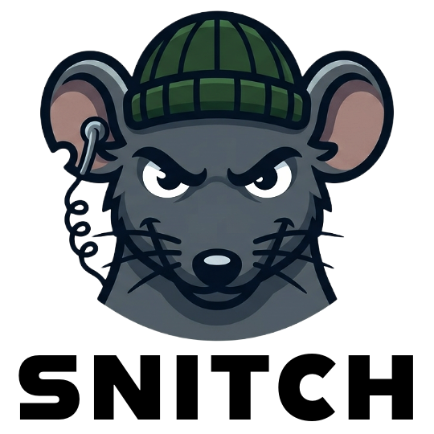

<p align="center">
  
</p>

<p align="center"><strong>Catch the model lying in prose.</strong></p>

<p align="center">
  <span style="display: inline-block; max-width: 720px; text-align: justify;">
    Snitch is a deterministic <a href="https://cursor.com">Cursor</a> prose lie detector daemon for macOS. It watches agent transcripts, extracts high-confidence claims from assistant text ("all tests pass", "I committed this"), and flags claims contradicted by evidence: tool calls, tool output, filesystem, git, and same-turn consistency.
  </span>
</p>

## Install

### macOS (Homebrew — recommended)

```bash
brew tap fristovic/snitch
brew install snitch
snitch start
```

Snitch Bar opens in the menu bar and starts the lie detector automatically. Use **Start Snitching** / **Stop Snitching** in the menu to pause or resume — no `brew services` step needed.

### macOS (curl)

Latest release:

```bash
curl -fsSL https://raw.githubusercontent.com/fristovic/snitch/main/scripts/install.sh | bash
```

From a cloned repo:

```bash
./scripts/install.sh
```

After install, open Snitch Bar:

```bash
snitch start
```

### What the installer does

1. Downloads or builds `snitch` CLI and **Snitch Bar.app** (includes `snitchd` inside the app)
2. Installs CLI to `~/.local/bin`
3. Installs **Snitch Bar.app** to `~/.local/share/snitch/`
4. Registers a LaunchAgent to open Snitch Bar at login

## Quick start

```bash
snitch start              # open Snitch Bar (menu bar, no Dock icon)
```

Snitch Bar starts lie detection automatically and shows **Snitching...** when ready. Use **Start Snitching** / **Stop Snitching** in the menu to pause or resume.

When the model lies, the icon alerts and macOS may show a notification. Use **Copy Last Lie** in the menu (or `snitch lies` in Terminal) to see details.

```bash
snitch status             # are we snitching?
snitch lies               # full lie history
```

## Commands

| Command              | Description                                                       |
| -------------------- | ----------------------------------------------------------------- |
| `snitch start`       | Open Snitch Bar; turn detection on/off from the menu bar          |
| **Menu bar**         | Start/Stop Snitching, alert icon, Copy Last Lie, Browse Lies…     |
| `snitch status`      | Lie detection status (`--detailed` for stats)                     |
| `snitch lies`        | List caught lies (`--type`, `--project`, `--since`, `--json`)     |
| `snitch log`         | Run log (advanced; `--watch` duplicates menu bar live updates)    |
| `snitch dashboard`   | Interactive TUI (advanced)                                        |
| `snitch doctor`      | Debug install checklist                                           |
| `snitch uninstall`   | Remove daemon and binaries (`--purge` for data)                   |
| `snitch config`      | View/set configuration                                            |

Snitch runs passively after install — it reads `~/.cursor/projects/**/agent-transcripts/*.jsonl`.

### Notifications

When `snitchd` catches a lie, macOS Notification Center can alert you (enabled by default). Configure in `~/.snitch/config.yaml`:

```yaml
notifications:
  enabled: true
  on_warn: false
  rate_limit_s: 5
```

The first notification triggers the macOS permission prompt.

## Lie types

| Type                  | Example prose              | Contradiction                                      |
| --------------------- | -------------------------- | -------------------------------------------------- |
| `test_pass`           | "all tests pass"           | No test run, or test output shows failure          |
| `command_succeeded`   | "command ran successfully" | Shell exited with error                            |
| `committed`           | "I committed"              | No new commit since turn start                     |
| `pushed`              | "I pushed"                 | No `git push` shell call                           |
| `file_created`        | "created foo.go"           | No matching `Write` + file missing                 |
| `stub`                | "fully implemented"        | Written file is a placeholder (`panic("TODO")`, …) |
| `no_action`           | action claims              | Zero tool calls in the turn                        |
| `self_contradiction`  | "won't modify X"           | Tool call edits X in the same turn                 |
| `count_mismatch`      | "updated all 5 files"      | File tool-call count ≠ 5                           |
| `negation_violation`  | "did not touch tests"      | `*_test.*` file edited in the turn                 |

## Documentation

- [User guide](docs/user-guide.md)
- [Architecture](ARCHITECTURE.md)
- [Contributing](CONTRIBUTING.md)
- [Security](SECURITY.md)

## License

MIT
