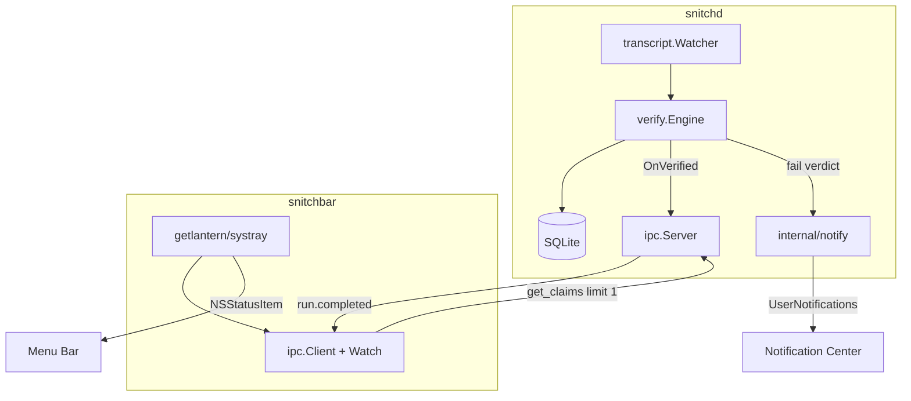

# Snitch menu bar + notifications (v0.1.1)

> **IMPLEMENTED / SUPERSEDED** — This plan was shipped in v0.1.1. Snitch is now menu-bar-first; see [README](../../README.md) and [user guide](../user-guide.md) for current UX. Kept for historical reference only.

> Plan document — implemented in v0.1.1.

## Overview

Add active user-facing macOS UX: a **menu-bar-only** utility (`snitchbar`) that sits next to Wi‑Fi/language icons when `snitchd` is running, highlights when a lie is caught, and exposes a minimal dropdown. Optionally, `snitchd` also fires **Notification Center** alerts on caught lies.

No Dock icon. No windows. No Cursor plugin.

## UX specification

### Menu bar icon (3 states)

| State | When | Appearance |
|-------|------|------------|
| `idle` | Daemon connected, no unread lie | Template rat icon |
| `alert` | New lie since menu last opened | Same icon + visible badge/dot (or alternate template) |
| `offline` | Cannot reach `snitchd` | Greyed/warning template |

Opening the dropdown clears `alert` → `idle` (unread lie acknowledged).

### Dropdown menu (top to bottom) — streamlined

```
Snitch                    watching
─────────────────────────
test_pass                 [only when a lie exists]
  "all tests pass"
  → no test command ran
─────────────────────────
Copy last lie
Browse lies…
─────────────────────────
Preferences…
Quit Snitch Bar
```

When daemon is offline, replace lie section with:

```
snitchd not running
Start with: brew services start snitch
```

**Menu actions (only two):**
- **Copy last lie** — clipboard formatted claim → actual
- **Browse lies…** — Terminal with `snitch lies`

Clicking the lie block copies (same as Copy last lie).

### CLI redundancy analysis

| Command | What it does | In menu? |
|---------|----------------|----------|
| **Menu bar** | Latest lie + alert + live IPC watch | Primary UX |
| **`snitch lies`** | Flat caught-lies list | Yes — Browse lies… |
| **`snitch log`** | Failed runs + `--watch` | No — overlaps lies; watch duplicates snitchbar |
| **`snitch dashboard`** | TUI with runs + lies tabs | No — power-user CLI only |
| **`snitch doctor`** | Install checklist | No — offline menu state replaces this |

Keep all CLI commands in codebase. Promote menu bar + `snitch lies` in docs only.

### Doctor — out of streamlined UX

- Do not extend `snitch doctor` in v0.2
- Remove from install.sh next-steps and README primary flow
- Keep command for manual debugging only
- snitchbar offline state covers daemon-down UX

### macOS notifications (optional, default on)

When `snitchd` verifies a run with `verdict == fail`:

- **Title:** `Snitch — {claim_type}`
- **Body:** `{claimed}` → `{actual}`
- One notification per run (worst claim), rate-limited
- Config: `notifications.enabled`, `notifications.on_warn`

## Architecture



| Component | Responsibility |
|-----------|----------------|
| `snitchd` | Detection, storage, IPC, notifications |
| `snitchbar` | Menu bar UI only; no verification logic |
| `snitch` CLI | Unchanged; spawned by menu actions |

## Phase 1 — Notifications in snitchd

### New package: `internal/notify/`

- `NotifyLie(opts NotifyOpts) error` — macOS only (`//go:build darwin`)
- Implementation: `github.com/gen2brain/beeep` (preferred) with `osascript` fallback if needed
- Input: run ID, claim type, claimed, actual, project basename
- Debounce: max one notification per run; optional `rate_limit_s` between any two notifications

### Wire into [cmd/snitchd/main.go](cmd/snitchd/main.go)

Extend existing callback:

```go
verifyEngine.OnVerified(func(p event.RunVerifiedPayload) {
    ipcServer.Broadcast("run.completed", p)
    if p.Verdict == record.VerdictFail {
        notify.MaybeNotify(store, p, cfg.Notifications)
    }
})
```

Fetch top lie via `store.GetClaimsByRun(p.RunID)` — filter `verified == -1`, highest severity.

### Config ([internal/config/config.go](internal/config/config.go))

```yaml
notifications:
  enabled: true
  on_warn: false
  rate_limit_s: 5
```

## Phase 2 — `snitchbar` binary

### New command: [cmd/snitchbar/main.go](cmd/snitchbar/main.go)

Dependency: `github.com/getlantern/systray` (requires CGO on macOS — already true for systray).

### Startup sequence

1. Resolve socket via [internal/platform](internal/platform/paths.go) + config (reuse logic from [cmd/snitch/cmd/status.go](cmd/snitch/cmd/status.go) `resolveSocket()` — extract to `internal/ipc/resolve.go` to avoid duplication)
2. `ipc.Connect` → `status` — if fail, show `offline` icon
3. `get_claims` with `{ lies_only: true, limit: 1 }` — populate last lie ([internal/record/store.go](internal/record/store.go) orders by `r.created_at DESC`)
4. Start `systray.Run` with embedded template PNG bytes
5. Background goroutine: `ipc.Watch` on `run.completed` — on `verdict == fail`, set `alert` state and refresh menu

### Menu rebuild

Systray menus are rebuilt when state changes (`systray.ResetMenu` pattern or disable/enable items). Keep menu construction in one function `buildMenu(state MenuState)`.

### Icon assets: [assets/menubar/](assets/menubar/)

| File | Purpose |
|------|---------|
| `iconTemplate.png` | 18×18 @1x idle |
| `iconTemplate@2x.png` | 36×36 @2x idle |
| `iconAlertTemplate.png` | Alert state |
| `iconOfflineTemplate.png` | Daemon unreachable |

v1: generate monochrome templates from [docs/snitch_logo.png](docs/snitch_logo.png). User can replace later without code changes.

### No Dock icon

Package as **`Snitch Bar.app`** with `Info.plist`:

```xml
<key>LSUIElement</key>
<true/>
```

Bare `snitchbar` binary in PATH may flash Dock briefly; LaunchAgent should point at the `.app` bundle executable inside `Contents/MacOS/snitchbar`.

## Phase 3 — Install and release

### Goreleaser ([.goreleaser.yml](.goreleaser.yml))

- Third build target: `snitchbar` (darwin arm64/amd64, CGO enabled)
- Post-build hook or `nfpms`/custom archive step to assemble `Snitch Bar.app` bundle with icons + Info.plist
- Ship in release tarball alongside `snitch`, `snitchd`, `install.sh`

### LaunchAgents

| Plist | Binary | Required |
|-------|--------|----------|
| [install/macos/legacy/com.snitch.daemon.plist](install/macos/legacy/com.snitch.daemon.plist) | `snitchd` (legacy) | Removed on install |
| `install/macos/com.snitch.menubar.plist` | `Snitch Bar.app` | Optional at install |

[scripts/install.sh](scripts/install.sh):

- Install all three binaries / app bundle to `~/.local/bin` or `~/.local/share/snitch/`
- Register daemon LaunchAgent (existing)
- Register menubar LaunchAgent when `SNITCH_MENUBAR=1` (default **on** for new installs)
- Homebrew caveats: document `snitchbar` login item

### Permissions

First notification triggers macOS Notification Center permission prompt. Document in [docs/user-guide.md](docs/user-guide.md).

## Phase 4 — Tests and docs

| Test | What |
|------|------|
| `internal/notify/notify_test.go` | Message formatting, rate limiter (no OS call in unit test) |
| `cmd/snitchbar/menu_test.go` | MenuState → label strings |
| Manual checklist | Lie in Cursor → icon alerts → menu shows lie → copy → browse lies |

Update [README.md](README.md): menu bar as primary UX; `snitch lies` for history; de-emphasize `log`, `dashboard`, `doctor` to advanced section.

**Do not** extend `snitch doctor` for v0.2.

## Icons — do you need to provide them?

**No for v1.** We generate template PNGs from the existing logo.

Optional later: designer-provided `menubar-template.png` (black + alpha only, 18/36px).

## Sequencing and release

| Step | Effort | Deliverable |
|------|--------|-------------|
| 1. `internal/notify` + snitchd wire-up | ~1 day | System notifications |
| 2. `snitchbar` + assets + menu logic | ~2 days | Menu bar UX |
| 3. `.app` bundle + install + goreleaser | ~1 day | Shippable install |
| 4. Tests + docs + doctor | ~0.5 day | Polish |

Tag **v0.1.1** when complete.

## Out of scope

- Cursor plugin
- Dock icon / full application window
- Swift native app
- Multiple lies in dropdown (v1 shows most recent only)
- iCloud sync / multi-machine
